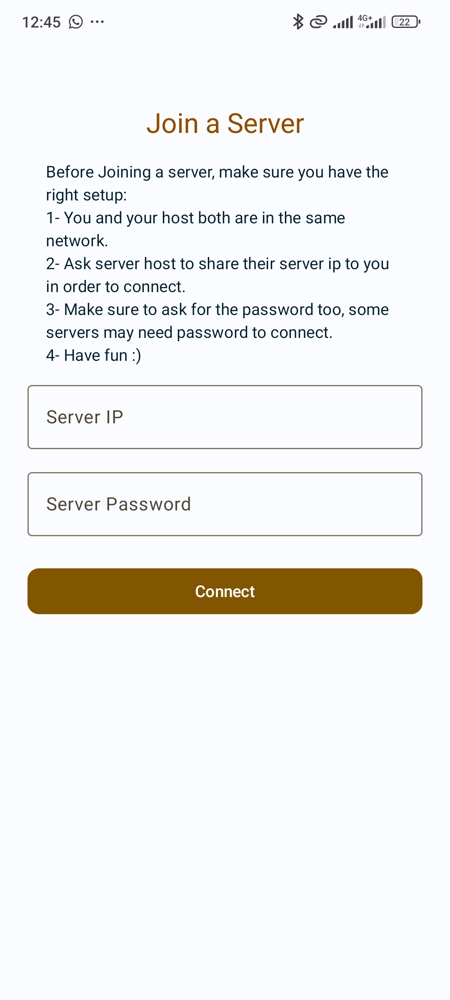
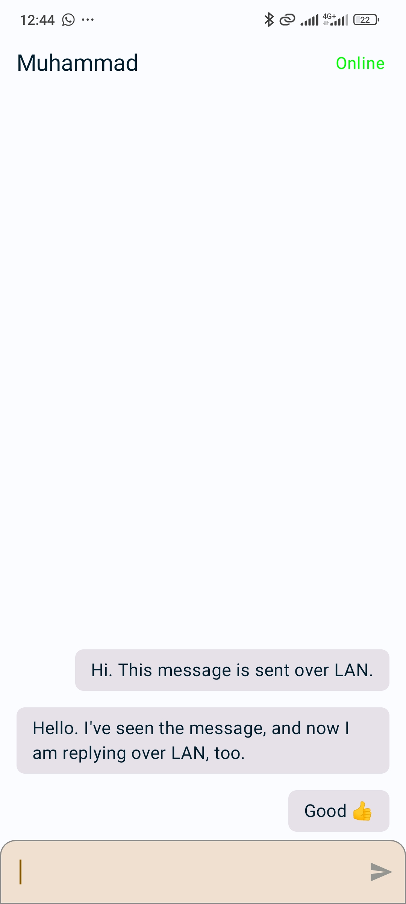

  

<h1 align="center">So Chat</h1>

  <b>Local LAN Chat for Android</b> 
  Connect, host, and chat with nearby devices — no internet required.
    
  
  
  

---

## 🚀 Overview
**So Chat** is an Android chat app designed to connect users over a **local Wi-Fi (LAN)** network — no internet connection needed.  
It’s perfect for classrooms, offices, or places with limited connectivity.

With So Chat, users can:
- **Host** a local chat session on their device.  
- **Join** a nearby hosted network with a username (and password if required).  
- **Chat instantly** with everyone connected to the same local session.

---

## 💡 Features
✅ Host or join local LAN chat rooms  
✅ Optional password protection for private sessions  
✅ Real-time messaging  
✅ Simple and lightweight interface  
✅ Works completely offline  

---

## 🧠 How It Works
1. One user creates a **host session** using So Chat.  
2. Others on the same local network can **discover** and **join** that session.  
3. All messages are sent **locally** — no data leaves your network.  

> 🔒 Password protection ensures only authorized users can join private chats.

---

## 📱 Installation
Download the latest version from the **[Releases Page](https://github.com/mohamedkam000/sochat/releases)** and install the APK on your Android device.

---

## 🧩 Tech Stack
- **Language:** Kotlin / Java  
- **Network:** LAN (Wi-Fi Direct / Socket communication)  
- **Platform:** Android SDK  

---

## 📸 Screenshots
| Host Screen | Join Screen | Chat Screen |
|--------------|--------------|--------------|
|  |  |  |

---

## 🤝 Contributing
Contributions, issues, and feature requests are welcome!  
Feel free to check the [issues page](https://github.com/mohamedkam000/sochat/issues).

---

## 📄 License
This project is licensed under the [MIT License](LICENSE).

---

  

  Made by <a href="https://github.com/mohamedkam000">Muhammad Kamal</a>

